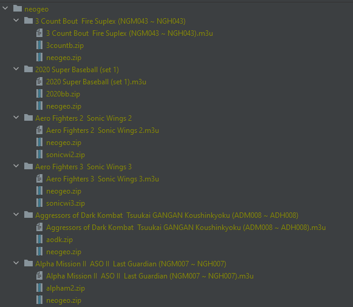

## minUI-arcade-filename-converter


### Why do you need this?
- In minUI (this applies to RG35XX, but I believe it will work for miyoo mini as well), Arcade roms are displayed by the rom name (e.g., ```sf2```) instead of the name of the game (e.g., ```Street Fighter II The World Warrior (World 910522)```) itself, so it is not easy to recognize the game from the rom name. This tool basically converts the list of roms into the format that will show the list of game names under minUI. The game names are parsed from MAME DAT file.


### How to use
- Download ```run.exe``` from the release page
- Download and place MAME DAT file and place it where the ```run.exe``` file is located--you can download the DAT file from e.g., https://www.progettosnaps.net/dats/MAME/, 
  > Note: for neogeo, you need to download the bios file, ```neogeo.zip``` and place in the root directory as well
- create and place your arcade roms (e.g., MAME, FBNeo, neogeo, etc) under your rom folder; you can choose the name of the folder e.g., ```roms```, ```mame```, ```neogeo```,```cps2``` ```roms/mame``` or ```roms/neogeo```, etc (this rom folder should be under directory where you unzipped the ```run.py```)
- Now you are ready to process the games, open cmd go to the location where ```run.exe``` exists
- Usage:
  ```
  run.exe -d <datfilename> -r <romfoldername>
  ```
- Example of usage:
  ```
  run.exe -d MAME_ROMs_253.dat -r roms/neogeo
  ```
- A new feature added: if you place ```neogeo.zip``` in the root directory and the roms directory name contains the string ```neogeo``` the neogeo bios will be copied into the sub folder which is required to run the neo-geo games 

### Example output
- As you can see, a folder is generated with the game name that will be shown in minUI game list along with m3u and origin zipped rom file




### Please contact me for any bugs.
