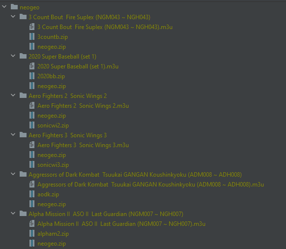

# MinUI Arcade Filename Converter


## Why do you need this?
In MinUI (this applies to RG35XX, but I believe it will work for Miyoo Mini as well), Arcade roms are displayed by the rom name (e.g., `sf2`) instead of the actual name of the game (e.g., `Street Fighter II The World Warrior`) itself, so it is not easy to recognize the game from the file list. 

This tool converts the list of roms into a folder structure that will show the proper game names under MinUI. The game names are parsed from a MAME DAT file.

## ✨ New Features
*   **Smart Matching:**
    1.  **Exact Match:** Checks if the filename matches a ROM in the DAT file exactly.
    2.  **Fuzzy Match:** If no exact match is found, it looks for an **80% or greater similarity**. This helps identify files even if the naming isn't perfect.
*   **Forced NeoGeo Mode:** You can now manually force NeoGeo processing (BIOS copying/name shortening) using the `--neogeo` flag.
*   **BIOS Auto-Fill:** The script now recursively checks your output folders. If it finds a NeoGeo game folder missing the `neogeo.zip` bios, it will automatically copy it there.

## How to use

### Prerequisites
1.  **Download `run.exe`** from the release page.
2.  **Download a MAME DAT file** (XML format) and place it in the same folder as `run.exe`. You can download these from [Progetto Snaps](https://www.progettosnaps.net/dats/MAME/).
3.  **NeoGeo Bios:** If processing NeoGeo games, place `neogeo.zip` in the same directory as `run.exe`.

### Setup
Create a folder for your roms (e.g., `roms/mame`, `roms/fbneo`, or `roms/neogeo`) inside the directory where `run.exe` is located. Place your game zip files inside that folder.

### Running the Tool
Open a command prompt (cmd) in the folder where `run.exe` exists.

**Usage:**
```bash
run.exe -d <datfilename> -r <romfoldername> [options]
```

### Options
*   `-d`: The DAT filename (**Required**).
*   `-r`: The ROM folder name (**Required**).
*   `--neogeo` (or `-n`): Force NeoGeo mode (**Optional**). This ensures `neogeo.zip` is copied even if your folder name doesn't contain "neogeo".

### Example of usage
```bash
run.exe -d MAME_ROMs_253.dat -r roms/neogeo
```

### Example with forced NeoGeo mode
```bash
run.exe -d MAME_ROMs_253.dat -r roms/my_games --neogeo
```

## NeoGeo Logic
A feature is included for NeoGeo games:
1. If you place `neogeo.zip` in the root directory...
2. **AND** the roms directory name contains the string "neogeo" **OR** you use the `--neogeo` flag...
3. The tool will automatically copy the `neogeo.zip` bios into every subfolder that contains a game.

## Example output
As you can see, a folder is generated with the game name that will be shown in the minUI game list along with the `.m3u` file and the original zipped rom file.



## How to generate executable
```bash
pyinstaller --onefile run.py